# Mathisi

(z grec. "uczyć się")

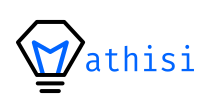

## Struktura repozytorium:

- `client` - Folder zawierający kod aplikacji mobilej
- `server` - Folder zawierający kod serwera

## Aplikacja Mathisi:

[Strona internetowa projektu](https://mathisi.piernik.rocks/)

## Opis:

**Mathisi** to aplikacja mobilna pozwalająca na bardzej efektywną naukę oraz wymianę wiedzy pomiędzy użytkownikami. Aplikacja pomoże przenieść twoje odręczne notatki z lekcji na pięknie sformatowane elektroniczne notatki za pomocą AI, wystarczy zrobić zdjęcie notatki i użyć. Umożliwia ona też na dzielenie się swoją wiedzą poprzez udostępnianie ich dla innych, a powtarzanie materiału nigdy nie było prostsze z automatycznie generowanymi fiszkami i quizami.

## Funkcjonalności:

- Zakładanie konta, logowanie, wylogowywanie
- Tworzenie notatek ręcznie, bądź z pomocą AI
- Dołączanie plików do notatek
- Zmiana widoczności notatki (publiczna/prywatna)
- Widok kumulujący publiczne notatki użytkowników
- System oceny notatek (głosy w góre/dół)
- Fiszki i quizy do każdej notatki generowane za pomocą AI
- Zapisywanie notatek za pomocą zakładek i osobna karta z ich listą
- Widok konta wraz ze zmianą profilowego

## Navigowanie po aplikacji:

Aplikacja Mathisi posiada następujące ekrany:

- Ekran logowania, umożliwiający oczywiście logowanie się jak i rejestrację

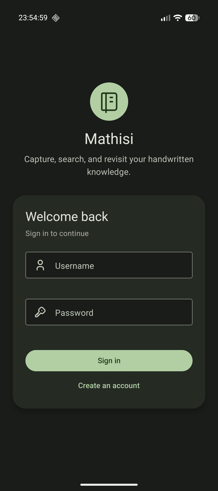

- Ekran domowy, zawierający notatki użytkownikami

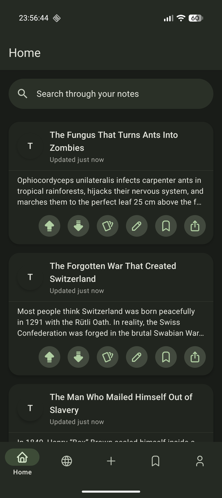

- Widok notatki, po kliknięciu w nią

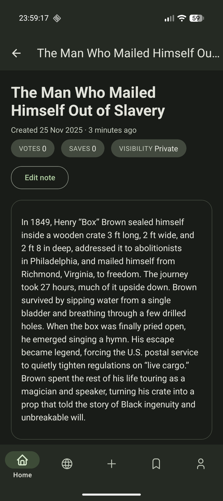

- Karta kumulująca publiczne notatki użytkowników

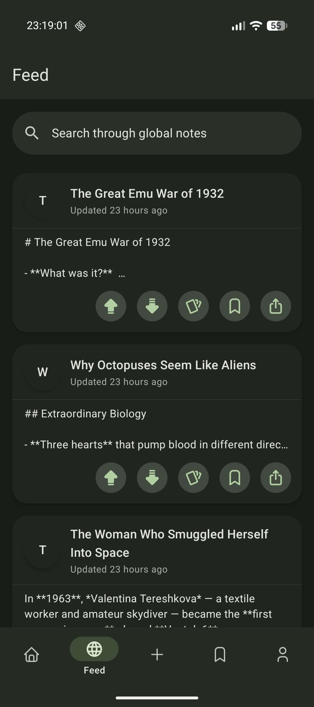

- Karta umożliwiająca dodanie notatek, zarówno tych ręcznych, jak i AI

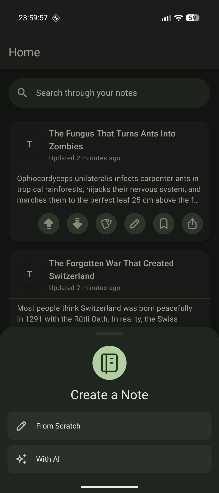
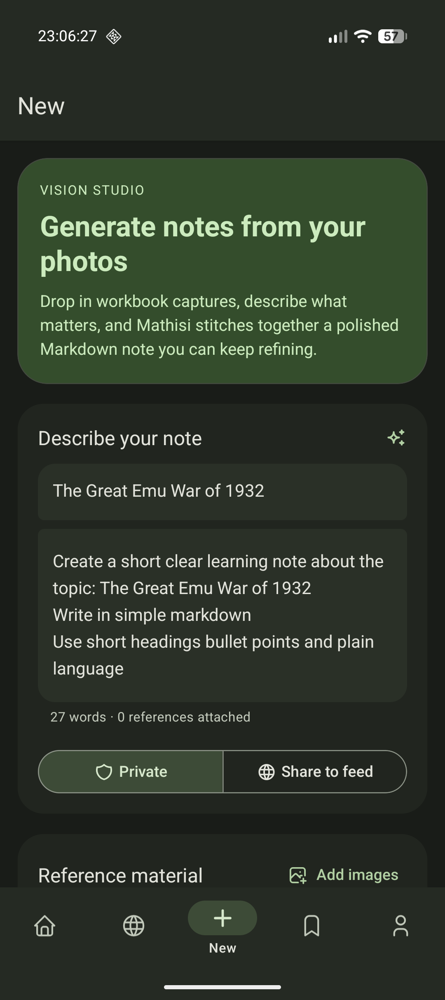

- Ekran edycji notatek

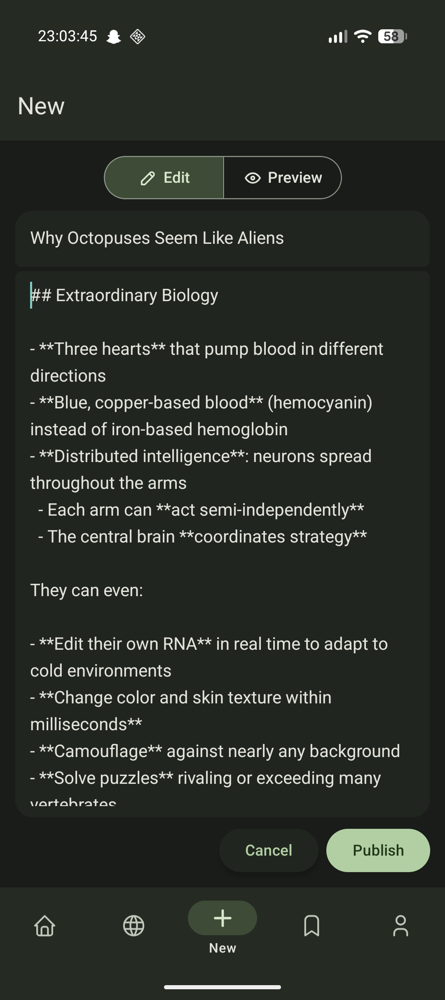
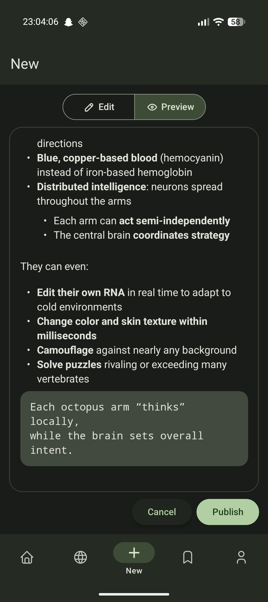

- Karta notatek dodanych do zakładek

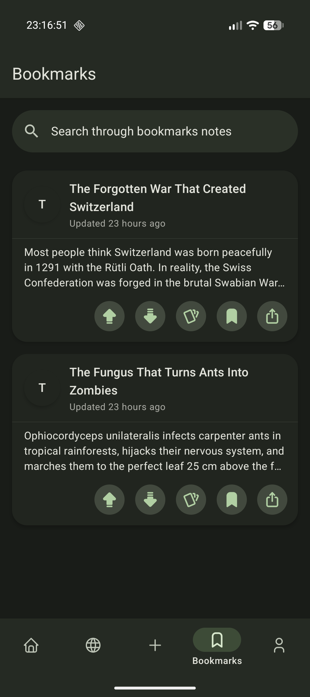

- Widok, informacji o koncie i przycisk do wylogowanie się

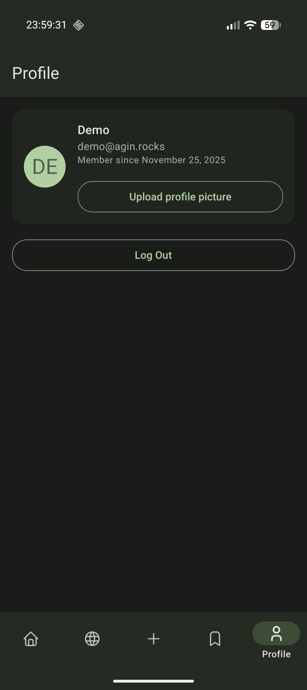

## Użyte technologie:

- Przy budowie projektu został użyty **React Native**, aby zapewnić mutiplatformowość aplikacji.
- Backend został napisany w języku programowania **Rust**, aby zapewnić bezpieczeństwo pamięci oraz najwyższą wydajność serwera.
- Projekt używa bazy **Postgres**

### Języki programowania:

- Rust (oczywiście)
- TypeScript
- JavaScript

### Inne, warte wspomienia technologie:

- Expo
- Docker

## Dalszy rozwój projektu:

Mamy bardzo dużo pomysłów w jaki sposób dalej rozwijać tą aplikację. Miedzy innymi chcemy w najbliższym czasie zaimplementować takie funkcje jak:

- system zaawansowanego szukania notatek po tagach
- system znajomych, który będzie śledził i porównywał postępy w nauce w twoim otoczeniu, motywując do dalszego działania
- automatyczne tłumaczenie notatek
- zaawansowane statystki dotyczące nauki, zarówno dla danej notatki, jak i ogólnie
  Mamy wizję, gdzie nasze rozwiązanie jest używane np. w całej szkole. Partnerstwo z firmą zajmującą się inżynierią modelów AI było by dużym motorem napędowym, jednak nie jest to w obecnym momencie realne.

## Ryzyka naszego rozwiązania:

Głównym zagrożeniem dla naszego rozwiązania jest zależność od zewnętrznych dostawców usług AI, którzy mogą dyktować swoje ceny za świadczenie usługi oraz zagrażać prywatności. Jesteśmy świadomi tych zagrożeń, jednak nie jesteśmy na ten moment w stanie ich wyeliminować, przez kosztowność takiego przedsięwzięcia.

## Dlaczego powinniśmy wygrać?

Uważamy, że nasz projekt jest w stanie pomóc uczniom, którzy mają problem ze zorganizowaniem swojego uczenia się przez niewystarczajaco schludne i poukładane notatki. Wiemy, iż nasza aplikacja potrzebuje jeszcze oszlifowania, jednak uważamy, że mimo wszystko jest w stanie się obronić swoim pomysłem oraz funkcjonalnościami, które już działają.
